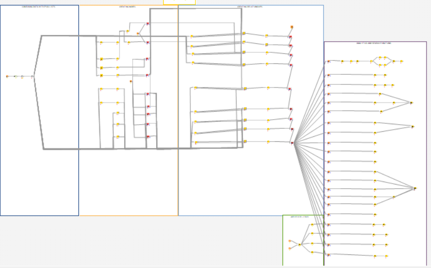
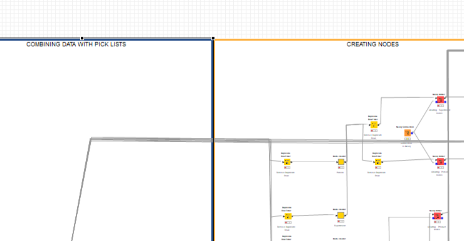
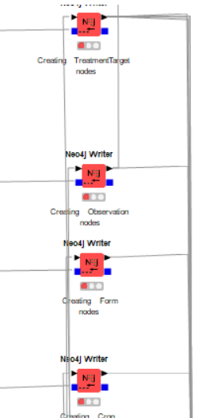
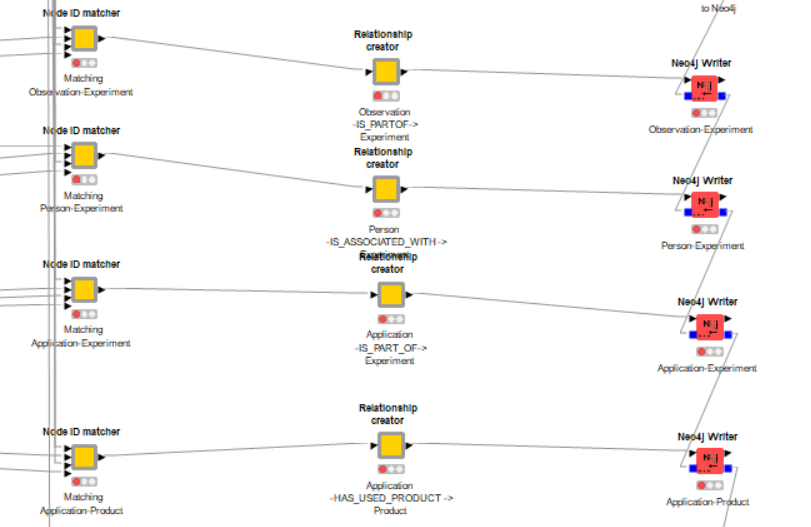
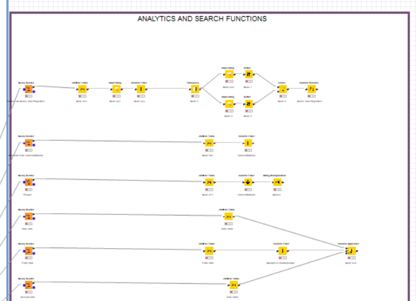
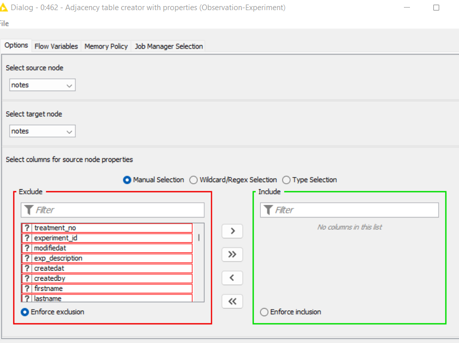

# Pipeline for dynamically creating Neo4j graphs from CSV files.
A really cool project I did with UPL 4 years ago. Documentation in progress, more details to come soon!

## Extraction pipeline:
Signals Electronic Lab Notebook -> Unstructured data -> structured data in CSV files 
Once the data was structured, Reed and I spent nearly two months creating this bad boy
 

Confusing, eh? Let's dig deeper and break it down

## Setting the groundwork to create the knowledge graph's nodes

## Creating the Neo4j Nodes

## Creating the relationships

## Analytics and graph query pipeline

## Selecting Property values for nodes and relationships in the adjacency table

